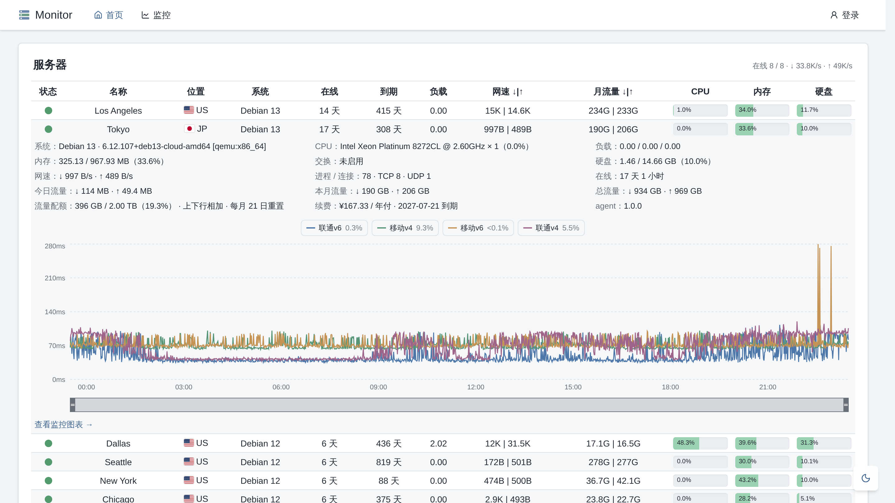

# monitor-theme-serverstatus

[monitor](https://github.com/monitor-probe/monitor) 的一款公开页主题，沿用经典 ServerStatus 的紧凑表格布局。

React + Vite + shadcn/ui，低饱和配色，支持暗色。



- 首页一张表：状态、位置、系统、在线时长、到期、负载、网速、月流量，以及 CPU、内存、硬盘三条用量条。
  点击一行展开详情，含交换、连接数、今日与总流量、流量配额、续费信息，以及最近 24 小时的网络延迟图
- 表格按面板自身宽度折叠列：窄于 1152px 收起「系统」「到期」，窄于 768px 再收起「在线」「月流量」
  并切换为固定列宽，手机上不需要横向滚动
- `/node/{id}` 是监控页：左侧节点列表可搜索，切换节点时保留所选的标签和时间范围；右侧为资源曲线
  与网络延迟

## 安装

从 [Releases](https://github.com/monitor-probe/monitor-theme-serverstatus/releases) 下载
`theme.tar.gz`，在 hub 后台「主题」页上传，或解压到 hub 的 `--themes` 目录下的 `serverstatus/`。
之后可在同一页切换，卡片上的 ⟳ 从本仓库的最新 release 更新。

## 开发

启动一个 hub 实例：

```bash
monitor-hub --listen 127.0.0.1:9911 --db /tmp/monitor.db --site http://127.0.0.1:9911
```

启动开发服务器，Vite 将 `/api` 与 WebSocket 代理至 hub：

```bash
npm ci
npm run dev
```

构建产物位于 `dist/`。提交前运行 `npm run build && npm run lint && npm test`。

`npm test` 校验数字格式化和实时指标的输入边界，由 Node 直接剥离类型运行，不依赖测试框架。

## 反代与 WAF

监控页用 `/node/{id}`。hub 对未知路径回落到 `index.html`，这对它足够；但 hub 前面若有按路径放行的
反代或 WAF，需要放行这个前缀。从列表点进去只是 pushState，刷新监控页才会真正请求该路径，症状是
「点进去正常，一刷新就被拦」。

## 许可

MIT。国旗图标来自 [flag-icons](https://github.com/lipis/flag-icons)，MIT。
